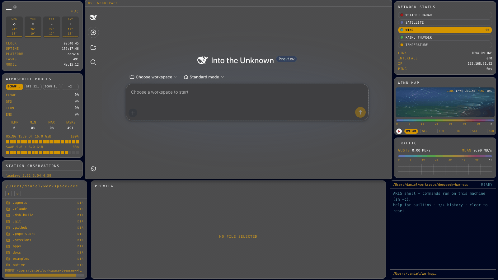

# dsh-edex-weather-ui

**WEATHER — a windy.com wind-map command center as a terminal shell.** A DeepSeek
Harness eDEX-UI theme variant built from a vision analysis of
[windy.com](https://www.windy.com/) (web-discovered reference, direction
"weather command center"): Windy's translucent dark-chrome map-app panels,
amber/gold selection language, and animated wind field re-imagined as an eDEX
terminal overlay for the DSH web GUI.




## Theme

| Token | Value | From the reference |
|---|---|---|
| Canvas | `#000722` | deep navy map shadow |
| Chrome (panels/cards/workspace) | `#4d4d4e` | Windy's translucent gray chrome, measured |
| Primary accent | `#d49500` | amber/gold selection (Go Premium pill, time badge) |
| Alert red | `#9d0300` | play triangle + hamburger button |
| Brand red | `#a71c20` | Windy logo circle |
| Map cyan / blue / green | `#4a94a2` / `#536bae` / `#53a554` | the data field palette |
| Card chrome | 1px `#6a6a6c` hairline, 10px radius, soft black shadow | the floating panel language |

Active states are **fills, not bars** — the selected layer/model row carries the
amber fill with dark text, exactly like Windy's ECMWF chip. No glow: depth comes
from translucency and soft shadows.

## Features

- **WIND MAP (featured)** — replaces the WORLD VIEW globe: a canvas wind-particle
  field drifting along a seeded flow field over the navy pressure gradient, with
  the kt color-scale legend, live LINK/PING readout, and a mini forecast timeline
  (white circular play button + red triangle, amber HH:MM badge, day ticks,
  blinking playhead)
- **ATMOSPHERE MODELS** — the forecast-model selector as segmented chips
  (ECMWF 9KM active amber / GFS 22KM / ICON 13KM / +2) over live per-core
  sparklines relabeled as model runs, plus real TEMP/MIN/MAX/TASKS and
  memory/swap block bars
- **STATION OBSERVATIONS** — the live top-processes table styled as Windy's city
  station readouts (amber hot values), with the real loadavg footer
- **CURRENT CONDITIONS** — big thin temperature (real host thermal °C where
  exposed), condition row from the real power state, sample forecast chips with
  the amber intensity strips, and real clock/uptime/platform lines
- **MAP LAYERS** — the layer rail as pill rows (WEATHER RADAR / SATELLITE /
  **WIND active** / RAIN, THUNDER / TEMPERATURE) with colored layer dots, over
  the real LINK/INTERFACE/IP/PING lines
- **WIND PROFILE** — the measured kt legend gradient over the live dual
  throughput trace (cyan mean, amber gusts)
- **Bottom strip** — DIR filesystem browser, PREVIEW/editor, and a real host
  TERMINAL (`systemMetrics.runCommand`), each in the chrome card language
- **Center workspace** — the original DSH UI framed by a 1px chrome border + the
  `DSH WORKSPACE` title strip, on the same #4d4d4e chrome surface; never occluded
- **Workspace chrome** — the sidebar, composer (20px pill input with amber
  caret), and workspace tree retheme to near-white-on-chrome with amber
  selection fills, without touching the user's theme preference

## Installation

The plugin is published to npm as `@danielng23/dsh-edex-weather-ui`. From the
harness checkout:

```sh
DSH_HOME=/tmp/your-dsh-home pnpm dsh plugin --profile web add @danielng23/dsh-edex-weather-ui
```

Packages:

- `@danielng23/dsh-edex-weather-ui` — the bundle (add this one)
- `@danielng23/dsh-weather-client-ui-edex` — the shell + widgets client
- `@danielng23/dsh-weather-client-ui-theme-terminal` — the weather theme row
- `@danielng23/dsh-weather-host-system-metrics` — the system-metrics Host Remote

## Analysis & review

- `analysis.json` / `analysis.md` — the vision-derived theme tokens, border
  language, and widget reconciliation plan
- `review.md` — the review evidence: computed-style probes, vision zooms, the
  animation verification, and documented divergences
- `reference-shot.png` — the captured windy.com reference (1600×900)

## License

MIT
