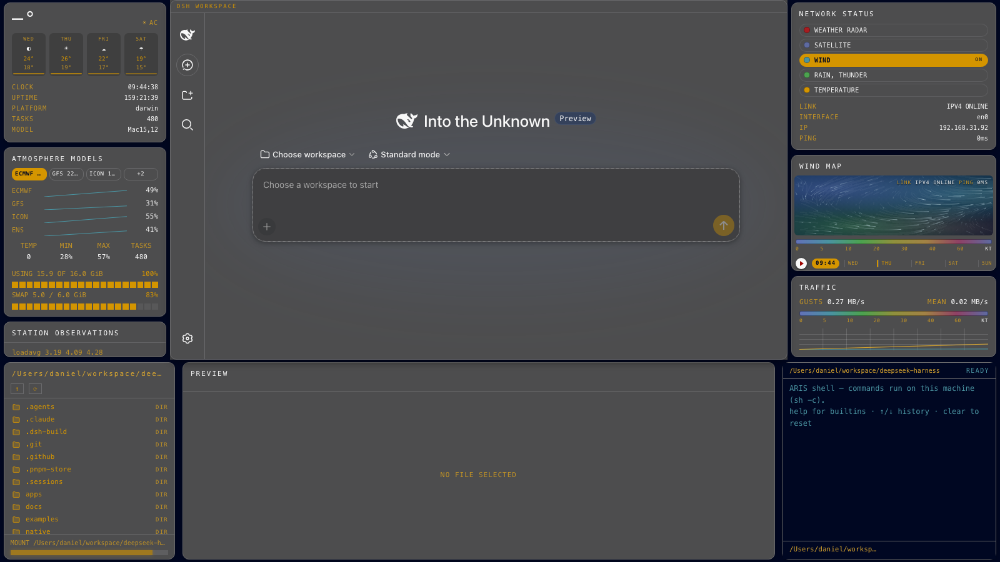

# @danielng23/dsh-edex-weather-ui

**WEATHER** — a windy.com wind-map command center as a terminal shell: a
DeepSeek Harness eDEX-UI theme variant built from a vision analysis of
[windy.com](https://www.windy.com/). Windy's translucent dark-chrome panels,
amber/gold selection language, and animated wind field, re-imagined as a
terminal overlay around the original DSH UI.



## Features

- **WIND MAP (featured)** — canvas wind-particle field over the navy pressure
  gradient, kt color-scale legend, live LINK/PING readout, mini forecast
  timeline (play button + red triangle, amber HH:MM badge, day ticks)
- **Left bar** — CURRENT CONDITIONS (big thermal readout + forecast chips),
  ATMOSPHERE MODELS (ECMWF/GFS/ICON chips over live per-core sparklines),
  STATION OBSERVATIONS (live process table as station rows + loadavg)
- **Right bar** — MAP LAYERS pill rail (WIND active amber), the featured WIND
  MAP, and the WIND PROFILE kt scale over the live throughput trace
- **Bottom strip** — DIR filesystem browser, PREVIEW/editor, real host TERMINAL
- **Center workspace** — the original DSH UI framed by a chrome border + the
  `DSH WORKSPACE` title strip on the #4d4d4e surface; never occluded
- **Workspace chrome** — sidebar, composer (20px pill input, amber caret), and
  workspace tree retheme to near-white-on-chrome with amber selection fills

## Installation

From the harness checkout:

```sh
DSH_HOME=/tmp/your-dsh-home pnpm dsh plugin --profile web add @danielng23/dsh-edex-weather-ui
```

## Packages

| Package | Host/Client | Description |
|---|---|---|
| `@danielng23/dsh-edex-weather-ui` | — | Installable bundle (`cordis.patch.yml`) |
| `@danielng23/dsh-weather-client-ui-edex` | client | The weather shell frame and all widgets |
| `@danielng23/dsh-weather-client-ui-theme-terminal` | client | Appearance → weather theme row |
| `@danielng23/dsh-weather-host-system-metrics` | host | Station telemetry RPC endpoints |

## License

MIT
